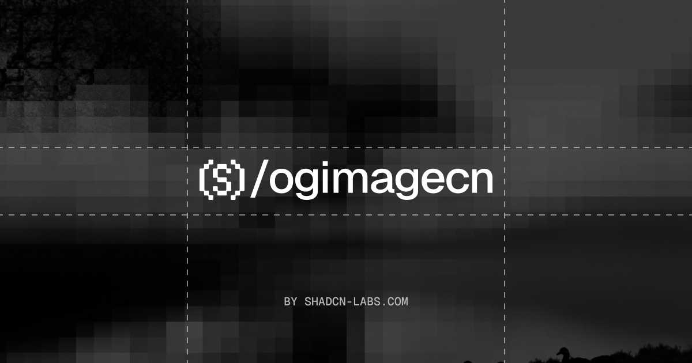

  

<h1 align="center">ogimagecn</h1>

  Free & open-source, ready-to-use, customizable Open Graph image components for React. 
  Copy, paste, and ship. Built on <a href="https://github.com/vercel/satori">Satori</a>, works seamlessly with <a href="https://ui.shadcn.com/">shadcn/ui</a>.

  
  
  
  

  <a href="https://ogimagecn.vercel.app/docs">Get Started</a> ·
  <a href="https://ogimagecn.vercel.app/docs/installation">Installation</a> ·
  <a href="https://ogimagecn.vercel.app/docs/blocks">Blocks</a> ·
  <a href="https://ogimagecn.vercel.app/docs/components">Components</a>

## Features

- ⚡ **Built on Satori** — Renders to real PNGs through the `next/og` runtime
- 🎯 **Zero config** — Works out of the box with sensible defaults
- 👀 **Live previews** — The same component renders as a faithful, scaled DOM preview
- 🎨 **Fully customizable** — Sensible props with defaults; you own the code
- 📦 **shadcn/ui compatible** — Uses the same registry format and CLI
- 🧩 **Composable** — Blocks are built from Satori-safe components (avatar, badge, brand mark, grid lines) you can reuse
- 🖼️ **OG image blocks** — Blog, changelog, event, product, quote, photo, shadcn registry cards, and more

## Community

The ogimagecn community lives on [GitHub](https://github.com/shadcn-labs/ogimagecn), where you can ask questions, share ideas, and show what you've built.

## Contributing

Contributions are welcome. See [CONTRIBUTING.md](CONTRIBUTING.md) to get the repo running locally and land a change, and use [issues](https://github.com/shadcn-labs/ogimagecn/issues) and [discussions](https://github.com/shadcn-labs/ogimagecn/discussions) to collaborate. By participating, you agree to the [Code of Conduct](./CODE_OF_CONDUCT.md).

## Security

Please do not open public issues for security vulnerabilities. Follow [SECURITY.md](./SECURITY.md) and report them privately through GitHub Security Advisories.

## License

[MIT](LICENSE)

## Contributors

> Made with [contrib.rocks](https://contrib.rocks)

## Stats

## Star History

<a href="https://www.star-history.com/?repos=shadcn-labs%2Fogimagecn&type=date&legend=top-left">
 <picture>
   <source media="(prefers-color-scheme: dark)" srcset="https://api.star-history.com/chart?repos=shadcn-labs/ogimagecn&type=date&theme=dark&legend=top-left&sealed_token=JiKEbONnIIE3VLgyDfM2csrG8EZyCuu7tLD_Y78spiwKglEOsL5Wp3LhzoHNrzqCoPUkSkuSLbfD41BDacn7gcNl08Fa0xFeNf6nPt9UJXJ6dYI3QwFucBNe7oniZT7hx_Ifp9PJObOrjdqOLqDboajRYABsTCUhCGLbIj42QdTQOl9Wa293sjal8cpU" />
   <source media="(prefers-color-scheme: light)" srcset="https://api.star-history.com/chart?repos=shadcn-labs/ogimagecn&type=date&legend=top-left&sealed_token=JiKEbONnIIE3VLgyDfM2csrG8EZyCuu7tLD_Y78spiwKglEOsL5Wp3LhzoHNrzqCoPUkSkuSLbfD41BDacn7gcNl08Fa0xFeNf6nPt9UJXJ6dYI3QwFucBNe7oniZT7hx_Ifp9PJObOrjdqOLqDboajRYABsTCUhCGLbIj42QdTQOl9Wa293sjal8cpU" />
   
 </picture>
</a>
